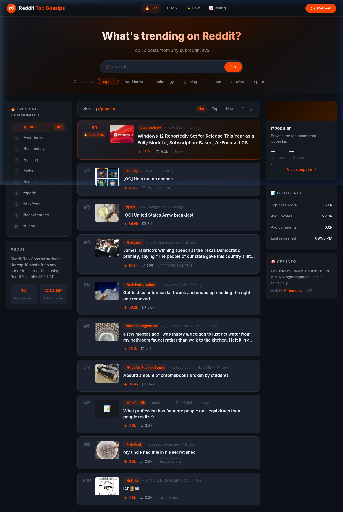
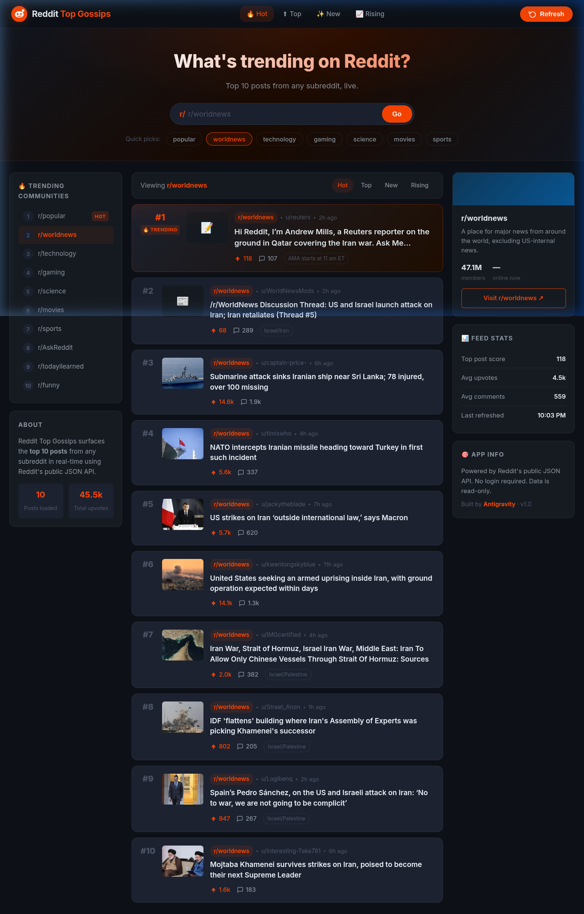
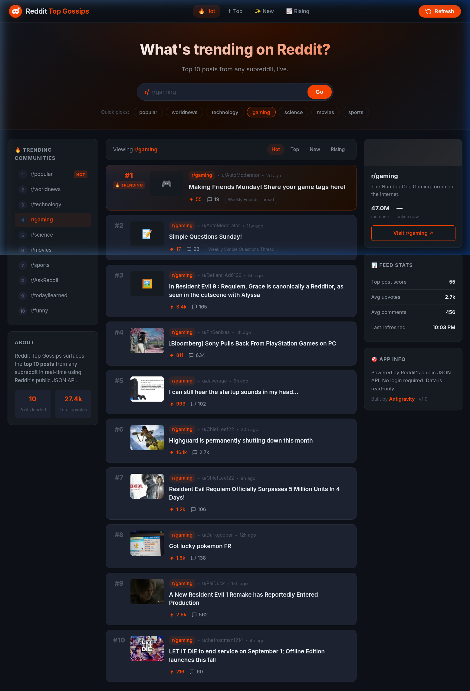

<div align="center">


# 🔴 Reddit Top Gossips

**Instantly browse the top 10 trending posts from any subreddit — live, no login required.**

[](#)
[](https://developer.mozilla.org/en-US/docs/Web/HTML)
[](https://developer.mozilla.org/en-US/docs/Web/CSS)
[](https://developer.mozilla.org/en-US/docs/Web/JavaScript)
[](https://www.reddit.com/dev/api/)
[](LICENSE)

</div>

---

## 📸 Preview



> *Top 10 trending posts from `r/popular` with live upvote counts, thumbnails, and the #1 post highlighted with a 🔥 TRENDING badge.*

<details>
<summary>📷 More screenshots</summary>

**Switching to r/worldnews**


**Switching to r/gaming**


</details>

---

## ✨ Features

| Feature | Description |
|---|---|
| 🔴 **Live Reddit Data** | Fetches real posts from Reddit's public JSON API — no API key or login needed |
| 🏆 **Top 10 Posts** | Ranked list with upvotes, comments, author, time, thumbnail, and flair |
| 🔥 **Trending Badge** | The #1 post gets a glowing special card treatment |
| 🔍 **Subreddit Search** | Type any subreddit name and hit Go |
| ⚡ **Quick Picks** | 7 one-click popular subreddits |
| 🔃 **Sort Modes** | Hot / Top / New / Rising — all switchable in one click |
| 📊 **Live Stats** | Feed stats (avg upvotes, top score, last refreshed) update on every fetch |
| 🏘️ **Community Info** | Right sidebar shows member count, active users, and subreddit description |
| 🌙 **Dark Mode** | Glassmorphism dark theme with Reddit-inspired `#FF4500` red accent |
| 📱 **Responsive** | 3-column desktop → 2-column tablet → 1-column mobile |
| ⚠️ **Error Handling** | Friendly error message with Retry button for invalid or private subreddits |

---

## 🗂️ Project Structure

```
Reddit Top Gossips/
├── index.html          # App entry point — 3-column layout (navbar, hero, sidebar, feed)
├── style.css           # Glassmorphism dark theme, animations, responsive breakpoints
├── app.js              # Reddit JSON API, post rendering, stats, error handling
├── docs/
│   ├── screenshot-home.png        # r/popular screenshot
│   ├── screenshot-worldnews.png   # r/worldnews screenshot
│   ├── screenshot-gaming.png      # r/gaming screenshot
│   └── demo.webp                  # Live demo recording
├── Productdesign.md    # Full product design document
└── README.md           # You are here
```

---

## 🚀 Getting Started

No build step. No dependencies. No package manager.

### Option 1 — Just open it

```bash
# Clone the repo
git clone https://github.com/sandeshMagar22/Reddit-Top-Gossips.git
cd Reddit-Top-Gossips

# Open in browser
open index.html          # macOS
xdg-open index.html      # Linux
start index.html         # Windows
```

### Option 2 — Serve locally (avoids CORS in some browsers)

```bash
# Python 3
python3 -m http.server 8080
# Then open: http://localhost:8080
```

> **Note:** Because this app calls `reddit.com` from a `file://` URL, most modern browsers allow the request (Reddit sends CORS headers). If you hit CORS errors, use the local server option above.

---

## 🔌 API Reference

This app uses Reddit's **free, public JSON API** — no OAuth, no API key.

| Endpoint | Purpose |
|---|---|
| `GET /r/{sub}/{sort}.json?limit=10` | Fetch top 10 posts by sort (hot/top/new/rising) |
| `GET /r/{sub}/about.json` | Fetch subreddit metadata (members, description, color) |

**Example:**

```
https://www.reddit.com/r/worldnews/hot.json?limit=10&raw_json=1
```

**Post fields used:**

| Field | Used for |
|---|---|
| `title` | Post title (displayed & linked) |
| `score` | Upvote count |
| `num_comments` | Comment count |
| `author` | `u/username` |
| `subreddit` | `r/subreddit` tag |
| `thumbnail` | Thumbnail image |
| `permalink` | Link to reddit.com post |
| `created_utc` | Time-ago display |
| `link_flair_text` | Flair badge |
| `over_18` | NSFW flag |

---

## 🏗️ Architecture

```
User Input (subreddit / sort)
        │
        ▼
  sanitizeSubreddit()         ← strips r/ prefix, removes bad characters
        │
        ▼
  fetchPosts()                ← GET /r/{sub}/{sort}.json
  fetchSubredditInfo()        ← GET /r/{sub}/about.json   (parallel)
        │
        ▼
  renderPosts(posts)          ← builds post card DOM elements
  updateStats(posts)          ← updates sidebar stats
  updateCommunityInfo(info)   ← updates right sidebar
```

### Key Functions in `app.js`

| Function | What it does |
|---|---|
| `load(subreddit, sort)` | Orchestrates a full fetch + render cycle |
| `fetchPosts(sub, sort)` | Calls Reddit API, throws a typed error on failure |
| `fetchSubredditInfo(sub)` | Fetches community metadata (non-blocking) |
| `renderPosts(posts)` | Generates 10 animated post cards |
| `updateStats(posts)` | Computes and displays feed stats |
| `sanitizeSubreddit(raw)` | Strips `r/` prefix and sanitizes input |
| `timeAgo(epochSec)` | Converts Unix timestamp to "3h ago" etc |
| `formatNumber(n)` | Formats `15700` → `15.7k` |

---

## 🎨 Design System

| Token | Value | Usage |
|---|---|---|
| `--accent` | `#FF4500` | Reddit orange-red — CTAs, badges, active states |
| `--bg-base` | `#0d1117` | Page background |
| `--bg-surface` | `#161b22` | Sidebar cards |
| `--bg-card` | `#1c2230` | Post cards |
| `--text-primary` | `#e6edf3` | Main text |
| `--text-secondary` | `#8b949e` | Meta, labels |
| Font | `Inter` | Google Fonts |

---

## 🗺️ Roadmap

- [ ] Auto-detect the most trending subreddit of the day
- [ ] Category filter tabs (News, Gaming, Science…)
- [ ] Light / dark mode toggle
- [ ] Share a post card as an image
- [ ] Infinite scroll (load next page on scroll)
- [ ] Keyboard navigation support

---

## 🤝 Contributing

Pull requests are welcome!

```bash
# Fork → clone → branch → change → PR
git checkout -b feature/my-cool-feature
git commit -m "feat: add my cool feature"
git push origin feature/my-cool-feature
```

---

## 📄 License

MIT © 2026 [SandeshMagar22](https://github.com/sandeshMagar22)

---

<div align="center">

Built with ❤️ by **Antigravity** · Powered by the [Reddit Public JSON API](https://www.reddit.com/dev/api/)

</div>
